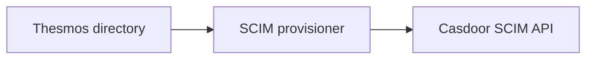

# Casdoor integration build

A patched Casdoor build for OIDC/SAML sign-in, SCIM user/group provisioning
and configurable JWT claims. This repository supplies the patches, image builder
and a local Compose recipe.

Casdoor is developed by the [Casdoor project and its contributors](https://github.com/casdoor/casdoor).
Thesmos maintains these integration changes independently. The original authorship,
licences and notices are preserved.

## Who benefits from these patches

Applications and provisioners that use Casdoor's OIDC, SAML or SCIM interfaces
can benefit from these changes: reliable SCIM lookups and account updates,
stable SAML identity, structured JWT claims and stricter token/client checks.
These behaviors use standard Casdoor configuration and protocol endpoints.

Thesmos is the integration example used here. To use another application,
configure its client, redirect URI, SAML settings or SCIM mappings as appropriate.
The patches and builder are available for reuse under their published licences.

## Thesmos integration examples

| Your task | What the integration provides |
| --- | --- |
| Sign in to Thesmos Community | Casdoor OIDC, with stricter redirect and application checks when exchanging or inspecting tokens. |
| Sign in to Thesmos Enterprise | Casdoor SAML, with an optional stable user ID for account linking. |
| Provision users and groups from Thesmos Enterprise into Casdoor | Casdoor's SCIM API receives the provisioning requests. Our patches improve lookups, pagination, group identifiers and user deactivation. |
| Provision a Thesmos Enterprise directory from Casdoor | A SCIM provisioner reads Casdoor's users/groups and writes them to Thesmos. Our SCIM response and stable SAML identity changes support this flow. |
| Set application authorization claims | Administrator-configured JWT fields and typed JSON values, validated before saving. |
| Customize the login experience | Casdoor's organization/application theme and branding settings, saved in its database. |
| Run Casdoor alongside Thesmos | A rebuilt container and local Compose recipe, with PostgreSQL configuration and runtime limits. |

## How SCIM provisioning works

The provisioner sends changes to the destination's SCIM API:



For the reverse direction, the provisioner reads Casdoor and writes to Thesmos.
Choose the authoritative directory for each set of users and groups. The Casdoor
image provides the Casdoor API; configure the provisioner as a separate component.
See [SCIM configuration and request example](docs/CONFIGURATION.md#scim-provisioning).

## What we changed in Casdoor

The main changes address identity synchronization, stable SAML account linking,
typed JWT claims and token/client validation. We also update dependencies and
retain their distribution notices and sources. Each change is explained in
[why the patches exist](docs/PATCHES.md).

Themes, OIDC, SAML and the underlying SCIM API come from Casdoor. The integration
build keeps these features configurable through Casdoor's administrator UI/API.

## Try the current version

Current source: **`v4.15.0-thesmos.1-rc.1`**, based on Casdoor **`v4.15.0`**,
targeting **`linux/amd64`**. The source, patches, builder and local recipe are
available. Registry publication is pending.

This is an evaluation candidate. Use a disposable database and keep access on
loopback while [production requirements](docs/RELEASE-STATUS.md) remain open.

Requires Git, Python 3, authenticated GitHub CLI and Docker with Buildx:

```sh
python3 scripts/validate-project.py
python3 scripts/build-image.py
```

The output is `casdoor-integration:candidate`. Follow the
[Compose setup instructions](recipes/README.md) to configure PostgreSQL and start
Casdoor. A single PostgreSQL server can host both applications using separate
databases and restricted roles.

## Documentation

- [Configure themes, JWT claims, SAML and SCIM](docs/CONFIGURATION.md)
- [Understand the patches](docs/PATCHES.md)
- [Check version status and limitations](docs/RELEASE-STATUS.md)
- [See validation coverage](docs/VALIDATION.md)
- [Read image source and licence information](docs/DISTRIBUTION.md)
- [Maintain or release the integration](MAINTENANCE.md)
- [Publish and verify an image](docs/REGISTRY.md)
- [Report a security issue](SECURITY.md)

## Licence and contributions

Original integration material is licensed under [Apache License 2.0](LICENSE).
You may use, modify and redistribute it under that licence. Casdoor and all
other dependencies retain their own copyrights, licences and applicable notices;
see [NOTICE](NOTICE) and [distribution contents](docs/DISTRIBUTION.md).
Contributions are welcome here. Upstream submissions require a manual maintainer
decision.
