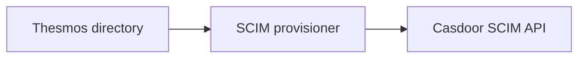

# Casdoor integration build

A patched build of [Casdoor](https://github.com/casdoor/casdoor) `v4.15.0` for
OIDC and SAML sign-in, SCIM provisioning of users and groups, and structured JWT
claims. This repository contains the patches, the image builder, and Compose and
Kubernetes recipes.

Thesmos maintains this build. Casdoor is developed by the Casdoor project and its
contributors; their authorship, licences and notices are kept.

## Deploy

The current release is `v4.15.0-thesmos.2` for `linux/amd64`:

```text
registry.thesmos.dev/thesmos/casdoor@sha256:fcb88561aa8aa4080fbc18a307e509ee4f1bc3901ddbee5cc56492bb05dce003
```

The tag `v4.15.0-thesmos.2` points to the same image. Deploy by digest so the
image cannot change under you.

1. [Verify the image signature and SBOM](docs/REGISTRY.md#verify-a-published-image).
2. Choose a recipe: [Compose](recipes/compose/README.md) for one server, or
   [Kubernetes](recipes/kubernetes/README.md) for a cluster. Both run this image
   against your PostgreSQL database.
3. Create the initial administrator password file before the first start;
   Casdoor refuses to start without it. See
   [secure startup](docs/CONFIGURATION.md#initial-administrator-and-secure-startup).
4. Before an upgrade, read the [release notes](docs/RELEASE-NOTES.md).

You do not need to build anything. One PostgreSQL server can host Casdoor and
Thesmos in separate databases with restricted roles.

## What this build changes

| Area | Change |
| --- | --- |
| SCIM | Lookups by `userName`, `externalId` and `displayName`; correct totals and paging; group `externalId` kept; accounts disabled through `active`; a `PUT` keeps Casdoor-only account state. |
| SAML | An optional persistent NameID based on the user ID, so an email or username change keeps the account link. |
| JWT | Claims with JSON values (objects, arrays, booleans), validated when the application is saved. |
| Tokens | The redirect URI must match exactly; a token is active only for the client it was issued to; previous signing keys can stay valid during a rotation. |
| Startup | No default administrator password; unsafe settings are refused; the database connection pool is limited; cookies are marked `Secure` behind an HTTPS proxy. |
| Security | Redirect URIs no longer match subdomains; database syncers verify the SSH server key; dependencies are updated. |

[The patches page](docs/PATCHES.md) explains why each change exists. Themes,
OIDC, SAML and SCIM come from Casdoor and are configured in its administrator UI
or API.

These changes use standard Casdoor settings and protocol endpoints, so any OIDC,
SAML or SCIM application benefits. Configure its client, redirect URI, SAML
settings or SCIM mappings in Casdoor.

## Use it with Thesmos

| Task | How |
| --- | --- |
| Sign in to Thesmos Community | Casdoor OIDC. |
| Sign in to Thesmos Enterprise | Casdoor SAML, optionally with the persistent NameID for stable account links. |
| Send Thesmos Enterprise users and groups to Casdoor | A SCIM provisioner writes to Casdoor's SCIM API. |
| Send Casdoor users and groups to Thesmos Enterprise | A SCIM provisioner reads Casdoor's SCIM API and writes to Thesmos. |
| Give applications authorization data | JWT claims configured on the Casdoor application. |
| Brand the sign-in page | Casdoor's organization and application themes. |

A SCIM provisioner is a separate component that copies changes from one
directory's SCIM API to the other:



Choose which directory is authoritative for each set of users and groups. See
[SCIM provisioning](docs/CONFIGURATION.md#scim-provisioning).

## Documentation

- [Deploy with Compose or Kubernetes](recipes/README.md)
- [Configure SCIM, JWT claims, SAML, themes and startup](docs/CONFIGURATION.md)
- [Release notes and limits](docs/RELEASE-NOTES.md)
- [Why each patch exists](docs/PATCHES.md)
- [Automated tests](docs/VALIDATION.md)
- [Security review](docs/SECURITY-REVIEW.md)
- [Verify or publish an image](docs/REGISTRY.md)
- [Image sources and licences](docs/DISTRIBUTION.md)
- [Maintain and release this build](MAINTENANCE.md)
- [Report a security issue](SECURITY.md)

## Build the image yourself

To check or change the patches, build the same image from this repository. You
need Git, Python 3, an authenticated GitHub CLI and Docker with Buildx:

```sh
python3 scripts/validate-project.py
python3 scripts/build-image.py
```

The local image is `casdoor-integration:candidate`; see
[use your own build](recipes/compose/README.md#use-your-own-build).

## Licence and contributions

The material in this repository is licensed under the [Apache License 2.0](LICENSE).
Casdoor and every other dependency keep their own copyrights, licences and
notices; see [NOTICE](NOTICE) and [image sources and licences](docs/DISTRIBUTION.md).
Contributions are welcome here. Changes are offered to the Casdoor project only
by a maintainer's decision.
